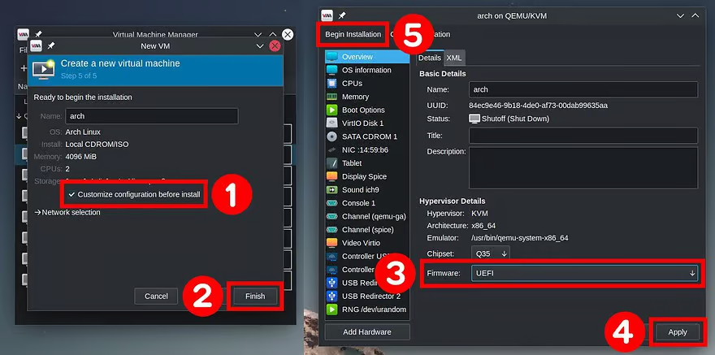
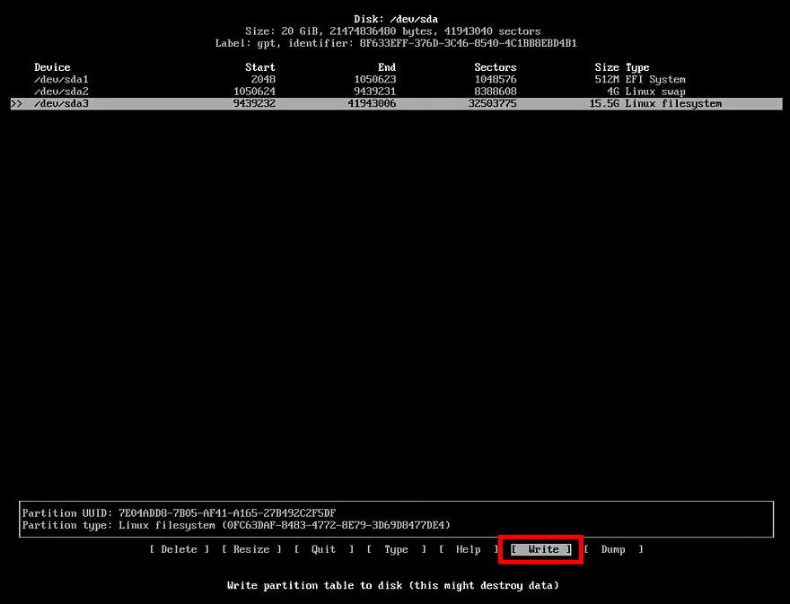

# Как установить Arch Linux: пошаговое руководство для начинающих
Arch Linux проста в установке. В этом руководстве показано, как установить Arch Linux шаг за шагом, что проложит путь к успешной настройке.

Многие пользователи Linux хотят попробовать Arch Linux, но общее представление о том, что Arch сложен в установке и освоении, останавливает их. Когда люди говорят, что это “трудно”, они имеют в виду, что это требует усилий. И они правы – вам нужно приложить немного больше усилий для установки вашей системы, настройки всего и чтения о том, как делать то, что вы хотите.

Однако в награду за ваши усилия вы получите систему, которую хорошо понимаете и настраиваете именно так, как вам хочется. После установки Arch Linux запускается так же просто, как и любой другой дистрибутив, если не проще.

Вы можете установить Arch Linux непосредственно на свой компьютер, следуя этому руководству, но вы также можете установить его на виртуальную машину с помощью VirtualBox или другого программного обеспечения для виртуализации.

# Содержание
* [1. Загрузка установочного образа Arch Linux](#1-загрузка-установочного-образа-arch-linux)
* [2. Подготовка загрузочного USB-накопителя](#2-подготовка-загрузочного-usb-накопителя)
* [3. Загрузка Arch Linux с USB-накопителя](#3-загрузка-arch-linux-с-usb-накопителя)
* [4. Проверка подключения к Интернету](#4-проверка-подключения-к-интернету)
    * [4.1 Подключение по SSH(Необязательно)](#41-подключение-по-sshнеобязательно)

* [5. Разделение диска на разделы](#5-разделение-диска-на-разделы)
    * [5.1 Создание системного раздела EFI](#51-создание-системного-раздела-efi)
    * [5.2 Создание раздела подкачки](#52-создание-раздела-подкачки)
    * [5.3 Создание корневого раздела](#53-создание-корневого-раздела)
    * [5.4 Создание раздела Home(Необязательно)](#54-создание-раздела-homeнеобязательно)
    * [5.5 Запись изменений на диск](#55-запись-изменений-на-диск)

* [6. Создание файловой системы](#6-создание-файловой-системы)
* [7. Установка Arch Linux](#7-установка-arch-linux)
    * [7.1 Настройка конфигурации Pacman](#71-настройка-конфигурации-pacman)
    * [7.2 Установка системы](#72-установка-системы)
* [8. Настройка установленной системы Arch](#8-настройка-установленной-системы-arch)
* [9. Установка загрузчика GRUB на Arch Linux](#9-установка-загрузчика-grub-на-arch-linux)
* [10. Установка среды рабочего стола в Arch Linux](#10-установка-среды-рабочего-стола-в-arch-linux)
* [11. Создание учетной записи обычного пользователя](#11-создание-учетной-записи-обычного-пользователя)
* [12. Установка Arch Linux завершена](#12-установка-arch-linux-завершена)

## Примечания по предварительной установке для пользователей VirtualBox и KVM

**ВАЖНО!** Перед началом установки пользователи VirtualBox и KVM должны включить EFI в настройках виртуальной машины. В противном случае при попытке установить загрузчик GRUB возникнет ошибка.


**Установка Arch Linux VirtualBox:** 
Однако, если вы решили установить Arch на KVM с помощью диспетчера виртуальных машин, чтобы включить поддержку UEFI, выполните следующие действия.

Для удобной установки Arch Linux через SSH так же необходимо в настройках сети изменить тип подключения на **“Сетевой мост”**


На последнем шаге не спешите нажимать кнопку **“Готово”** при создании виртуальной машины. Убедитесь, что вы установили флажок **“Настроить конфигурацию перед установкой”**, затем нажмите **“Готово”**.

Откроется новое окно. В нем выберите **“UEFI”** из выпадающего меню “Прошивка”, затем подтвердите нажатием **“Применить”** и, наконец, нажмите **“Начать установку”**.



В этом руководстве по установке Arch Linux показан весь процесс в виде простых шагов. Итак, без лишних слов, давайте начнем.

## 1. Загрузка установочного образа Arch Linux
Первое, что нам нужно сделать, это получить образ Arch Linux. Для этого посетите [страницу загрузки](https://archlinux.org/download/) Arch Linux, чтобы загрузить файл ISO-образа. Затем загрузите последний образ компакт-диска. Доступны как прямые ссылки на скачивание, так и торрент-ссылки.


[К содержанию](#содержание)

## 2. Подготовка загрузочного USB-накопителя
Как только загрузка вашего ISO-файла Arch Linux завершится, вы должны создать из него live USB. Существует много способов подготовить USB-накопитель в режиме реального времени; один из них - с помощью команды dd.

В качестве альтернативы вы можете использовать такие приложения, как Ether или Ventoy, которые являются хорошими вариантами для создания загрузочного USB-накопителя.

[К содержанию](#содержание)
## 3. Загрузка Arch Linux с USB-накопителя
Как только вы создадите live USB для Arch Linux, выключите компьютер, подключите к нему USB-порт и загрузите систему.

Пожалуйста, помните, что иногда вы не можете загрузиться с подключенного USB-накопителя с включенной безопасной загрузкой. Если у вас именно так, зайдите в BIOS и сначала отключите безопасную загрузку.

Arch предоставляет вам два варианта установки – устаревший и режим UEFI. Режим UEFI (Unified Extensible Firmware Interface) является более современным, и большинство современных аппаратных средств поддерживает только установку UEFI. Таким образом, в этом руководстве по установке Arch Linux будет использоваться режим UEFI.

После правильной загрузки в ISO-файл Arch вы должны увидеть что-то похожее на изображение ниже.


Выберите опцию **“Arch Linux install medium (x86_64, UEFI)”** и нажмите **“Ввод”**.

После того, как установщик распакует и загрузит ядро Linux, вы будете автоматически перенаправлены на терминал с правами суперпользователя.


[К содержанию](#содержание)
## 4. Проверка подключения к Интернету
Прежде всего, проверьте подключение к Интернету. Чтобы проверить это, пропингуйте веб-сайт, как показано в примере ниже.

```bash
ping -c 3 archlinux.org
```
    Output

    PING archlinux.org (95.217.163.246) 56(84) bytes of data.
    64 bytes from archlinux.org (95.217.163.246): icmp_seq=1 ttl=52 time=57.4 ms
    64 bytes from archlinux.org (95.217.163.246): icmp_seq=2 ttl=52 time=57.4 ms
    64 bytes from archlinux.org (95.217.163.246): icmp_seq=3 ttl=52 time=58.4 ms

    --- archlinux.org ping statistics ---
    3 packets transmitted, 3 received, 0% packet loss, time 2003ms
    rtt min/avg/max/mdev = 57.394/57.739/58.376/0.450 ms

Если вы используете проводное соединение, оно обычно подключается автоматически. Однако, если вы получите сообщение об ошибке, пожалуйста, проверьте свое подключение к Интернету или маршрутизатор.

[К содержанию](#содержание)
### 4.1 Подключение по SSH(Необязательно)
После завершения проверки подключения мы можем задать пароль для Root пользователя для дальнейшего подключения через SSH. Для этого введите команду ниже и введите пароль.

```bash
passwd
```

Далее нам необходимо узнать адрес компьютера в сети для подключения по SSH с помощью команды:

```bash
ip addr
```


Теперь мы готовы подключиться к установке Arch через SSH.  Для этого воспользуйтесь командой и введите пароль от Root:

```bash
ssh root@ip_addr(ваш адрес)
```

[К содержанию](#содержание)
## 5. Разделение диска на разделы
Следующим шагом в нашем руководстве по установке Arch Linux является разбиение жесткого диска на разделы. Вот где вы, вероятно, столкнетесь с наибольшими трудностями, если не знакомы с инструментами разбиения на разделы, такими как fdisk или cfdisk. Но не волнуйтесь, это легко, как вы увидите.

Во-первых, перечислите свои диски:

```bash
fdisk -l
```
    Output

    Disk /dev/sda: 20GiB, 21474836480 bytes, 41943040 sectors
    Disk model: QEMU HARDDISK
    Units: sectors of 1 * 512 = 512 bytes
    Sector size (logical/physical): 512 bytes / 512 bytes
    I/O size (minimum/optimal): 512 bytes / 512 bytes

    Disk /dev/loop0: 662.69 MiB, 694882304 bytes, 1357192 sectors
    Units: sectors of 1 * 512 = 512 bytes
    Sector size (logical/physical): 512 bytes / 512 bytes
    I/O size (minimum/optimal): 512 bytes / 512 bytes

Для этого руководства была создана виртуальная машина с пустым жестким диском объемом 20 ГБ, обозначенным **“/dev/sda”**. Измените **“/dev/sda”** на название вашего устройства.

Для базового раздела нам нужно создать следующий макет раздела:

**/dev/sda1**: **Системный раздел EFI** размером 512 МБ, отформатированный в формате FAT32. Это обеспечивает пространство для хранения загрузчиков и других файлов, необходимых для загрузки.

**/dev/sda2:** **Раздел подкачки** размером 4 ГБ. Пространство подкачки используется для расширения виртуальной памяти за пределы установленной физической памяти (ОЗУ) или для поддержки записи на диск.

**/dev/sda3:** **раздел Linux** с оставшимся свободным местом на диске в формате EXT4. Это корневой раздел **(/)**, на котором будет храниться наша операционная система Arch Linux, файлы и другая информация.

(Необязательно)**/dev/sda4:** **раздел Home**, на котором будут храниться файлы и другая личная информация.

[К содержанию](#содержание)
### 5.1 Создание системного раздела EFI
Теперь давайте приступим к созданию таблицы разделов разметки диска, выполнив команду cfdisk на жестком диске компьютера

```bash
cfdisk /dev/sda
```


Выберите тип метки **“GPT”** и нажмите **“Enter”**.

Затем выберите **Free Space** и нажмите **New** в нижнем меню. Вы можете перемещаться по пунктам меню с помощью клавиш **“Tab”** или стрелок.


Введите размер раздела в МБ (“512M“) и нажмите клавишу **“Enter”**.


По-прежнему выбирая раздел **“/dev/sda1”**, выберите **“Type”** в нижнем меню и выберите тип раздела **“EFI System”**.


Вы закончили настройку системного раздела EFI.


[К содержанию](#содержание)
### 5.2 Создание раздела подкачки
Теперь давайте создадим раздел подкачки, используя ту же процедуру. Снова выберите **“Free space”** и нажмите **“New”**.


Введите размер раздела в ГБ (“4G“) и нажмите клавишу **“Enter”**.


По-прежнему выбирая раздел **“/dev/sda2”**, выберите **“Type”** в нижнем меню и выберите тип раздела **“Linux swap”**.


Вы закончили настройку раздела подкачки.


[К содержанию](#содержание)
### 5.3 Создание корневого раздела
Наконец, вы должны создать корневой раздел (/). Еще раз выберите оставшееся **“Free space”** и нажмите **“New”**.


Что касается размера, оставьте значение размера по умолчанию. Это означает все оставшееся свободное пространство. Далее нажмите клавишу **“Enter”**.


По-прежнему выбирая раздел **“/dev/sda3”**, выберите **“Type”** в нижнем меню и выберите тип раздела **“Linux filesystem”**.


Вы закончили настройку корневого раздела.


[К содержанию](#содержание)
### 5.4 Создание раздела Home(Необязательно)
Еще раз выберите оставшееся **“Free space”** и нажмите **“New”**.

Что касается размера, оставьте значение размера по умолчанию. Это означает все оставшееся свободное пространство. Далее нажмите клавишу **“Enter”**.

По-прежнему выбирая раздел **“/dev/sda4”**, выберите **“Type”** в нижнем меню и выберите тип раздела **“Linux filesystem”**.

Вы закончили настройку домашнего раздела.

[К содержанию](#содержание)
### 5.5 Запись изменений на диск
Далее вам нужно сохранить внесенные изменения. Выберите **“Write”** в нижнем меню и нажмите **“Enter”**.



Введите **“yes”** и нажмите клавишу **“Enter”**.


Мы здесь закончили. Выберите **“Quit”** и нажмите **“Enter”**, чтобы сделать это.


[К содержанию](#содержание)
## 6. Создание файловой системы
Теперь, когда разделы вашего диска готовы, пришло время создать файловую систему. Но давайте сначала просмотрим сводку таблицы разделов, выполнив следующее:

```bash
fdisk -l
```
    Output

    Disk /dev/sda: 20GiB, 21474836480 bytes, 41943040 sectors
    Disk model: QEMU HARDDISK
    Units: sectors of 1 * 512 = 512 bytes
    Sector size (logical/physical): 512 bytes / 512 bytes
    I/O size (minimum/optimal): 512 bytes / 512 bytes
    Disklabel type: gpt
    Disk identifier: 8F633EFF-376D-3C46-8540-4C1BB8EBD4B1

    Device       Start      End  Sectors  Size  Type
    /dev/sda1     2048  1050623  1048576  512M  EFI System
    /dev/sda2  1050624  9439231  8388608    4G  Linux swap
    /dev/sda3  9439232 41943006 32503775 15.5G  Linux filesystem

    Disk /dev/loop0: 662.69 MiB, 694882304 bytes, 1357192 sectors
    Units: sectors of 1 * 512 = 512 bytes
    Sector size (logical/physical): 512 bytes / 512 bytes
    I/O size (minimum/optimal): 512 bytes / 512 bytes

Так же есть упрощенный вывод разделов.

```bash
lsblk
```

Диск **“/dev/sda”** должен иметь три(четыре с Home) раздела (**“/dev/sda1”**, **“dev/sda2”** и **“/dev/sda3“**), аналогичные показанным выше.

При создании разделов на предыдущих этапах были определены границы пространства для хранения, предоставляемого жестким диском, и указан тип пространства между каждой линией границы.

Пришло время отформатировать разделы в соответствии с требуемыми файловыми системами. Здесь мы должны создать три файловые системы, так что давайте начнем.

Для типа раздела EFI создайте файловую систему FAT32.

```bash
mkfs.fat -F32 /dev/sda1
```

Подготовьте раздел подкачки:

```bash
mkswap /dev/sda2
swapon /dev/sda2
```

Для корневого раздела создайте файловую систему EXT4(Таким же образом и для Home, главное сменить номер раздела):

```bash
mkfs.ext4 /dev/sda3
```
[К содержанию](#содержание)
## 7. Установка Arch Linux
### 7.1 Настройка конфигурации Pacman
Перед установкой необязательным, но крайне полезным шагом является редактирование конфигурации Pacman. Для изменения конфигурации выполните следующую команду:

```bash
nano /etc/pacman.conf
```
Далее нажмите **Ctrl-W** для поиска и введите **Misc options**. Замените блок кода на этот:

    #UseSyslog
    Color
    ILoveCandy
    #NoProgressBar
    CheckSpace
    #VerbosePkgLists
    ParallelDownloads = 10

Теперь синхронизируйте репозиторий Pacman, чтобы вы могли загружать и устанавливать любое программное обеспечение:

```bash
pacman -Syy
```
[К содержанию](#содержание)
### 7.2 Установка системы
Мы должны смонтировать корневой раздел (**“/dev/sda3“**) в каталог **“/mnt”**, прежде чем мы сможем выполнить какую-либо установку.

```bash
mount /dev/sda3 /mnt
```
Для домашнего раздела (**“/dev/sda4“**) в каталог **“/mnt/home”**, но прежде необходимо создать эту директорию.

```bash
mkdir /mnt/home/ && mount /dev/sda4 /mnt/home
```

После установки root пришло время установить все необходимые пакеты. Используйте команду pacstrap для установки необходимых пакетов Arch Linux.

```bash
pacstrap -K /mnt base linux linux-firmware sudo nano
```

Загрузка и установка этих пакетов займет некоторое время. Но теперь мы можем приступить к настройке нашей системы.

[К содержанию](#содержание)
## 8. Настройка установленной системы Arch
После завершения установки сгенерируйте файл **“/etc/fstab”** для вашей новой системы Arch Linux, выполнив следующую команду:

```bash
genfstab -U /mnt >> /mnt/etc/fstab
```

Теперь, когда мы установили Arch Linux, нам нужно переключиться на физически установленный корневой раздел, используя команду arch-chroot.

```bash
arch-chroot /mnt
```

После перехода в нашу установленную систему проверните настройку конфигурации Pacman из предыдущего [пункта](#7-установка-arch-linux).

Далее давайте настроим часовой пояс. Чтобы найти свой часовой пояс, вы можете перечислить (`ls -l`) содержимое каталога **“/usr/share/zoneinfo/”**.

Найдите предпочитаемый вами часовой пояс (**“/usr/share/zoneinfo/Zone/SubZone“**), где **“Zone/SubZone”** - это ваш выбор, например **“Америка/Нью-Йорк”**, **“Европа/Париж”**, **“Азия/Бангкок”** и так далее. Ты уловил идею.

Создайте символическую ссылку для установки часового пояса (замените **“America/New_York”** на ваш часовой пояс).

```bash
ln -sf /usr/share/zoneinfo/America/New_York /etc/localtime
```

Теперь нам нужно настроить локаль. Файл “/etc/locale.gen” содержит настройки локали и системных языков и по умолчанию закомментирован. Мы должны открыть этот файл с помощью текстового редактора и раскомментировать строку, содержащую желаемый языковой стандарт.

```bash
nano /etc/locale.gen
```

Раскомментируйте **“en_US.UTF-8 UTF-8”** и **“ru_RU.UTF-8 UTF-8”** (удалив знак “#”) и любые другие необходимые локали в **“/etc/locale.gen”**. Затем нажмите **“Ctrl+O”**, затем **“Enter”**, чтобы сохранить, и, наконец, **“Ctrl+X”**, чтобы выйти из редактора.


Теперь сгенерируйте файл конфигурации локали, используя приведенные ниже команды одну за другой:

```bash
locale-gen
```

Запустите приведенную ниже команду для синхронизации аппаратных часов, автоматически создав файл **“/etc/adjtime”**, содержащий описательную информацию о настройке часов аппаратного режима и коэффициенте смещения часов.

```bash
hwclock --systohc
```

Создайте и установите переменную “LANG”.

```bash
echo LANG=ru_RU.UTF-8 > /etc/locale.conf && export LANG=ru_RU.UTF-8
```

Теперь мы продвинемся вперед и зададим имя хоста. Имя хоста - это имя компьютера. Итак, давайте назовем его, например, **“arch-pc”**. Используйте следующую команду:

```bash
echo arch-pc > /etc/hostname
```

Добавьте это имя также в файл **“/etc/hosts”**. Отредактируйте файл с помощью Nano editor и добавьте следующие строки (замените **“arch-pc”** на имя хоста, которое вы выбрали ранее).

```bash
nano /etc/hosts
```

    127.0.0.1      localhost
    ::1            localhost
    127.0.1.1      arch-pc

Не забудьте установить пароль для учетной записи root с помощью команды passwd:

```bash
passwd
```

Введите свой пароль дважды. Будьте внимательны, так как вы ничего не увидите во время набора текста.

[К содержанию](#содержание)
## 9. Установка загрузчика GRUB на Arch Linux
Теперь мы устанавливаем загрузчик для Arch, чтобы он загрузился после перезагрузки. Загрузчик по умолчанию для дистрибутивов Linux и Arch Linux также представлен пакетом GRUB.

Установите пакеты GRUB bootloader и EFI boot manager:

```bash
pacman -S grub efibootmgr os-prober mtools
```

Затем создайте точку монтирования для **“/dev/sda1”** и смонтируйте ее.

```bash
mkdir /boot/efi && mount /dev/sda1 /boot/efi
```

Теперь давайте установим наш загрузчик.

```bash
grub-install --target=x86_64-efi --bootloader-id=grub_uefi
```
    Output

    Installing for x86_64-efi platform.
    Installation finished. No error reported.

Наконец, сгенерируйте файл **“/boot/grub/grub.cfg”**.

```bash
grub-mkconfig -o /boot/grub/grub.cfg
```
[К содержанию](#содержание)
## 10. Установка среды рабочего стола в Arch Linux
Наш Arch Linux в настоящее время содержит только основные программные пакеты, необходимые для управления системой из командной строки, без GUI (графического интерфейса пользователя).

Arch Linux поддерживает широкий спектр сред рабочего стола. Я установлю GNOME в качестве примера среды рабочего стола.

Первым шагом является установка среды X. Введите приведенную ниже команду, чтобы установить Xorg в качестве сервера отображения.

```bash
pacman -S xorg-server xorg-apps
```

Затем установите соответствующий видеодрайвер.

Пользователи Nvidia:

```bash
pacman -S nvidia nvidia-utils
```

Пользователи AMD / ATI:

```bash
pacman -S xf86-video-ati
```

Пользователи Intel:

```bash
pacman -S xf86-video-intel
```

Теперь вы можете установить среду рабочего стола GNOME в Arch Linux с помощью:

```bash
pacman -S gnome gnome-extra networkmanager
```

GNOME предлагает широкий выбор поставщиков для загрузки. Выберите подходящего поставщика для каждого запроса и нажмите **“Enter”**, чтобы продолжить. Если вы не уверены, нажмите **“Enter”**, чтобы принять значения по умолчанию.

Наконец, включите диспетчер отображения GDM и сетевой менеджер.

```bash
systemctl enable gdm && systemctl enable NetworkManager
```
[К содержанию](#содержание)
## 11. Создание учетной записи обычного пользователя
Метод создания учетной записи пользователя также автоматически создаст домашний каталог для пользователя. Кроме того, мы можем предоставить этой учетной записи привилегии sudo. Напишите свое имя вместо “linuxuser”.

```bash
useradd -m -G wheel linuxuser
```

Обязательно установите пароль для нового пользователя:

```bash
passwd linuxuser
```

Затем включите привилегии sudo для вновь созданного пользователя:

```bash
EDITOR=nano visudo
```

Прокрутите экран вниз и найдите строку:

```
# %wheel ALL=(ALL) ALL
```

Раскомментируйте его, удалив знак #

[К содержанию](#содержание)
## 12. Установка Arch Linux завершена
Поздравляю! Мы закончили с нашей установкой Arch Linux, поэтому мы выйдем из терминала, размонтируем корневой раздел, установленный под **“/mnt”**, и перезагрузимся в нашу недавно установленную систему Arch Linux.

```bash
exit
```

```bash
umount -R /mnt
```

```bash
reboot
```

Вас поприветствует менеджер загрузки GRUB. Подождите несколько секунд или нажмите **“Enter”**, чтобы начать загрузку операционной системы.


Затем вас поприветствует менеджер входа в систему GDM GNOME. Нажмите на пользователя, которого вы создали ранее, и введите его пароль, чтобы войти в систему и наслаждаться вашей недавно установленной системой Arch Linux.


[К содержанию](#содержание)
